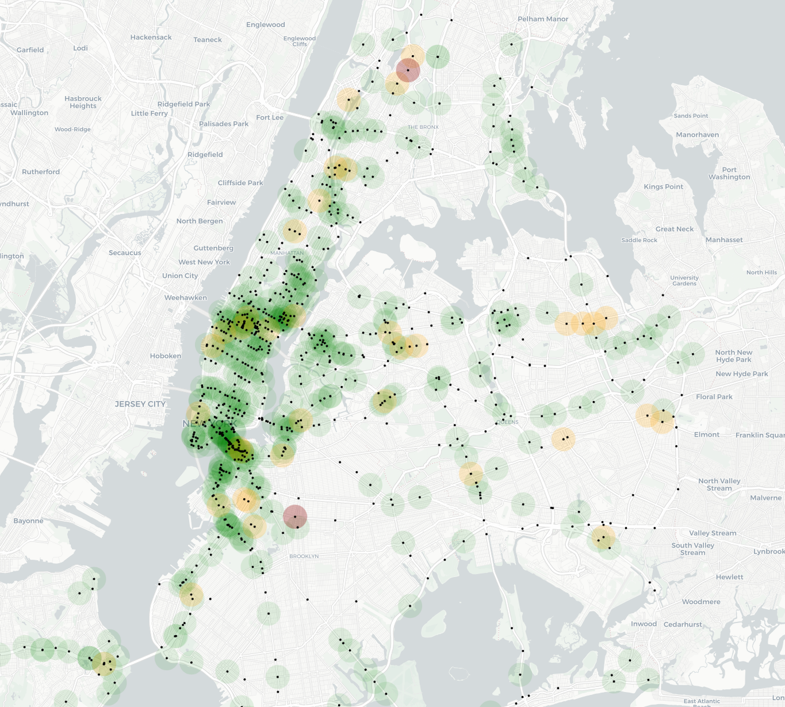
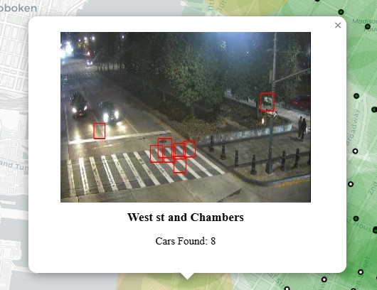
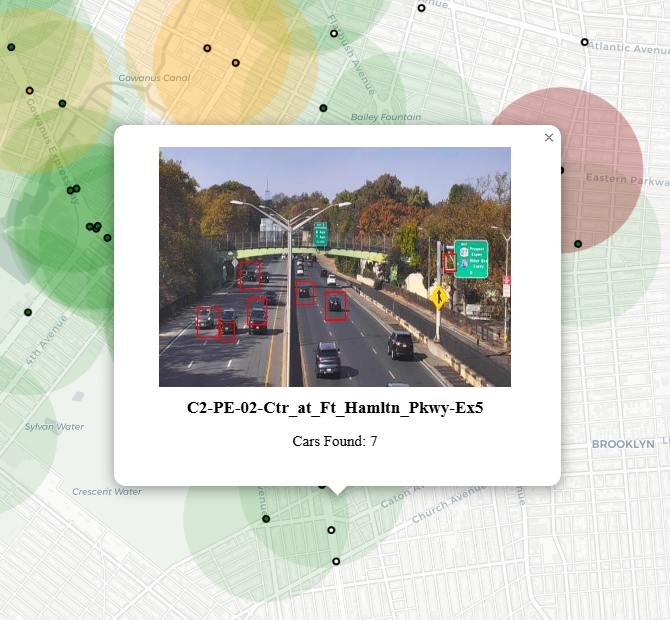
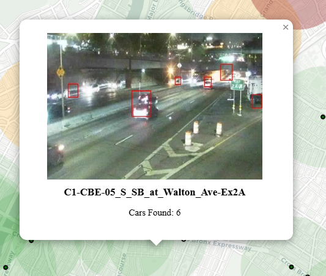

# NYC Traffic Map 

An interactive traffic map utilizing NYCDOT Traffic Management Center's traffic camera API and [vehicle detection with Haar Cascades](https://github.com/andrewssobral/vehicle_detection_haarcascades/tree/master) with OpenCV, built with Folium's python library.

A live version of the map can be found [here](https://gibbermusic.com/projects/) on my personal website, which is set to update around every hour or so. Clicking on a region will display the largest car count found with a preview of the camera and bounding boxes 

To generate or update the map locally as an html file, clone the repo, install the required libraries, then run 'main.py'. The updated map will be in the file named 'trafficMap.html'. Running the script usually takes a few minutes.

#
## Notes
The accuracy of the map isn't great during night due to glare and a lack of nighttime data in the vehicle detection model used. The model is trained for highway environments, so false positives from cameras in Manhattan are frequent, particularly ones with views of crosswalks. The tendency for Haar Cascade models to report false positives also doesn't help, but the accuracy for highways, notably in Queens, Brooklyn, and Staten Island are generally great.  

With this said, during the morning and afternoon, the heatmap provides a decent idea of the overall trend of traffic.

I plan to switch to a model specific to the provided cameras once I've annotated a large enough dataset of cars in order to fix these issues.
#
Bad Crosswalk Detection Example:

#
Good Detection Examples:

[
